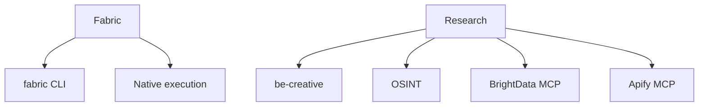

# PAI Service Catalog
## Comprehensive Capability Registry

**Generated:** 2026-06-21T18:09:10.459Z  
**Version:** 1.0

This catalog documents all available PAI services (capabilities provided to principal).

---

## Overview

- **112 Skills** - Specialized workflows and domain expertise
- **14 Agents** - Autonomous personas with tool access
- **Cross-Engine Coordination** - PNC/PNG/PNO/PNX/PNK unified service delivery

---

## Skills

### By Category


#### Thinking & Analysis (7)

| Skill | Description | Tier |
|-------|-------------|------|
| **ApertureOscillation** | Customization | medium |
| **DesignThinking** | Customization | medium |
| **FirstPrinciples** | Customization | medium |
| **Ideate** | Customization | medium |
| **Loop** | Customization | medium |
| **SystemsThinking** | Customization | medium |
| **Think** | Customization | medium |

#### Code & Engineering (5)

| Skill | Description | Tier |
|-------|-------------|------|
| **BitterPillEngineering** | Customization | medium |
| **BunFileIO** | Customization | medium |
| **ClaudeCodeFeatures** | ClaudeCodeFeatures | medium |
| **GitMemory** | GitMemory | medium |
| **Simplify** | Simplify | medium |

#### Research & Content (8)

| Skill | Description | Tier |
|-------|-------------|------|
| **ArXiv** | Customization | medium |
| **BulkMediaExtract** | Customization | medium |
| **ExtractWisdom** | Customization | medium |
| **Fabric** | Customization | medium |
| **Knowledge** | Customization | medium |
| **Research** | ⚠️ MANDATORY TRIGGER | medium |
| **ResearchPipeline** | Customization | medium |
| **YouTube** | Customization | medium |

#### Security (4)

| Skill | Description | Tier |
|-------|-------------|------|
| **PAISecurityAudit** | Customization | medium |
| **pno-local-triage** | Customization | medium |
| **SecurityTriage** | Customization | medium |
| **UXAudit** | Customization | medium |

#### Infrastructure (2)

| Skill | Description | Tier |
|-------|-------------|------|
| **cloudflare** | Voice Notification | medium |
| **cloudflare-email-service** | Customization | medium |

#### Design & UX (5)

| Skill | Description | Tier |
|-------|-------------|------|
| **Art** | Art Skill | medium |
| **DesignCritique** | Customization | medium |
| **Excalidraw** | Customization | medium |
| **UIUXProMax** | Customization | medium |
| **Webdesign** | Voice Notification (REQUIRED FIRST ACTION) | medium |

#### Other (81)

| Skill | Description | Tier |
|-------|-------------|------|
| **Agents** | 🚨 MANDATORY: Voice Notification (REQUIRED BEFORE ANY ACTION) | medium |
| **agents-sdk** | Customization | medium |
| **AnnualReports** | Customization | medium |
| **AntigravitySkill** | Customization | medium |
| **Aphorisms** | Customization | medium |
| **Apify** | Customization | medium |
| **AudioEditor** | AudioEditor | medium |
| **bbc** | Customization | medium |
| **BeCreative** | Customization | medium |
| **BrightData** | Customization | medium |
| **Browser** | Customization | medium |
| **ContextSearch** | Customization | medium |
| **Council** | Customization | medium |
| **CreateCLI** | Customization | medium |
| **CreateSkill** | Customization | medium |
| **Daemon** | Customization | medium |
| **Debate** | Customization | medium |
| **Delegation** | Customization | medium |
| **Documents** | Customization | medium |
| **durable-objects** | Customization | medium |
| **Evals** | Customization | medium |
| **ExploreThemes** | ExploreThemes | medium |
| **graphify** | Customization | medium |
| **GSDDiscussPhase** | Customization | medium |
| **GSDExecutePhase** | Customization | medium |
| **GSDNewProject** | Customization | medium |
| **GSDPlanPhase** | Customization | medium |
| **GSDVerifyWork** | Customization | medium |
| **InfoSecRiskAssessment** | Customization | medium |
| **Interceptor** | Customization | medium |
| **Interview** | Customization | medium |
| **ISA** | Customization | medium |
| **IterativeDepth** | Customization | medium |
| **KeyRotation** | Customization | medium |
| **McpProfiles** | Customization | medium |
| **MercuryFIM** | Customization | medium |
| **Migrate** | Customization | medium |
| **MultiEngineSynthesis** | MultiEngineSynthesis | medium |
| **NotebookLM** | Customization | medium |
| **OllamaSkill** | Customization | medium |
| **openspec-apply-change** | Customization | medium |
| **openspec-archive-change** | Customization | medium |
| **openspec-explore** | Customization | medium |
| **openspec-propose** | Customization | medium |
| **Optimize** | Customization | medium |
| **OSINT** | Customization | medium |
| **PAI** | Customization | medium |
| **PAIBridge** | Customization | medium |
| **PAIUpgrade** | Customization | medium |
| **ParentalControl** | Customization | medium |
| **Parser** | Customization | medium |
| **PIGSD** | Customization | medium |
| **PlaywrightCli** | PlaywrightCli | medium |
| **PrivateInvestigator** | Customization | medium |
| **ProgrammaticTools** | ProgrammaticTools | medium |
| **Prompting** | Customization | medium |
| **PromptInjection** | Customization | medium |
| **Recon** | Customization | medium |
| **RedTeam** | Customization | medium |
| **Remotion** | 🚨 MANDATORY: Voice Notification (REQUIRED BEFORE ANY ACTION) | medium |
| **RootCauseAnalysis** | Customization | medium |
| **Sales** | Customization | medium |
| **sandbox-sdk** | Customization | medium |
| **Science** | Customization | medium |
| **SECUpdates** | Customization | medium |
| **SendToMe** | Customization | medium |
| **SettingsLab** | Customization | medium |
| **Spatial3D** | Customization | medium |
| **Telos** | Customization | medium |
| **ThreadReply** | ThreadReply | medium |
| **TRVRM** | Customization | medium |
| **UnifiedCouncil** | Customization | medium |
| **USMetrics** | Customization | medium |
| **web-perf** | Customization | medium |
| **WebAssessment** | Customization | medium |
| **WebMcp** | WebMcp | medium |
| **WorkCommand** | Customization | medium |
| **workers-best-practices** | Customization | medium |
| **WorldThreatModel** | World Threat Model Harness | medium |
| **wrangler** | Customization | medium |
| **WriteStory** | 🚨 MANDATORY: Voice Notification (REQUIRED BEFORE ANY ACTION) | medium |

---

## Agents

| Agent | Description | Primary Tools |
|-------|-------------|---------------|
| **AgentsOrchestrator** | Autonomous pipeline manager for multi-agent software workflows | Task, Agent, Delegation |
| **Algorithm** | Expert in creating and evolving Ideal State Criteria (ISC) | Skill, ISA, FirstPrinciples |
| **Architect** | Elite system design specialist with PhD-level distributed systems knowledge | FirstPrinciples, SystemsThinking, ApertureOscillation |
| **Artist** | Visual content creator for editorial-quality images | Art, Excalidraw, Remotion |
| **Engineer** | Elite principal engineer using TDD and strategic planning | Algorithm, Simplify, roborev |
| **Explore** | Fast codebase navigation and pattern discovery | Glob, Grep, Read |
| **Designer** | Elite UX/UI design specialist with exacting standards | DesignCritique, UXAudit, Webdesign |
| **CodeReviewer-Agency** | Thorough code reviewer focused on correctness and security | roborev, SecurityTriage, Simplify |
| **InfraOps** | Infrastructure operations specialist managing Docker, systemd, backups | HealthCheck, Bash, systemd |
| **DBOps** | Database operations specialist for Qdrant and ICM memory | ICM, Qdrant, Schema |
| **ProductManager** | Read-only requirements analyst exploring codebase | Read, Grep, Glob |
| **QATester** | Quality validation agent using Browser skill per Article IX | Browser, Interceptor, Evals |
| **RealityChecker** | Skeptical quality gate agent requiring overwhelming evidence | Browser, Interceptor, Visual Proof |
| **SecurityTriage** | Adversarial triage of security findings | RedTeam, FirstPrinciples, SecurityAudit |

---

## External Integrations

### MCP Servers
- **ICM Memory** - Durable cross-engine memory (Qdrant vector DB)
- **Ollama** - Local LLM inference (llama3.2, qwen2.5, gemma2, deepseek-r1)
- **Council** - Multi-model debate and consensus
- **Pulse** - Cross-engine handoff and coordination

### External APIs
- **Anthropic** - Claude (PNC primary engine)
- **Google Gemini** - PNG research engine
- **OpenAI** - PNX verification engine
- **Perplexity** - Research via API
- **Cloudflare** - Workers, Pages, R2, D1, AI
- **Apify** - Social media scraping
- **BrightData** - Advanced web scraping

---

## Skill Dependencies

(Note: Only showing skills with explicit dependencies)




---

## Usage Patterns

### Skill Invocation
```typescript
// Direct skill call
Skill("SkillName", "task description")

// Skill with parameters
Skill("Research", "quick research on ITIL v4")
```

### Agent Spawning
```typescript
// Spawn subagent
Agent({
  subagent_type: "Engineer",
  prompt: "Implement ISC verification",
  model: "sonnet"
})

// Background agent
Agent({
  subagent_type: "general",
  prompt: "Research topic",
  run_in_background: true
})
```

---

## Service-Level Expectations

### Availability
- **Critical Skills** (HealthCheck, Security): ≥99.9%
- **Standard Skills**: ≥99%
- **External APIs**: Best-effort (depends on provider)

### Response Time
- **Local Skills** (<100ms): FirstPrinciples, SystemsThinking, Simplify
- **Fast Skills** (<5s): Research (quick), Ollama inference
- **Standard Skills** (<30s): Research (standard), Algorithm phases
- **Extended Skills** (>30s): Research (extensive), multi-agent coordination

### Quality Standards
- **ISC Pass Rate**: ≥95%
- **Euphoric Surprise**: ≥8/10 for significant work
- **Feedback Memories**: ≥1 per failed ISC

---

**Maintained By:** PAI System  
**Update Frequency:** Generate on demand via `bun PAI/Tools/GenerateServiceCatalog.ts`  
**Related:** `ITIL_FRAMEWORK.md`, `ITIL_QUICK_REFERENCE.md`
